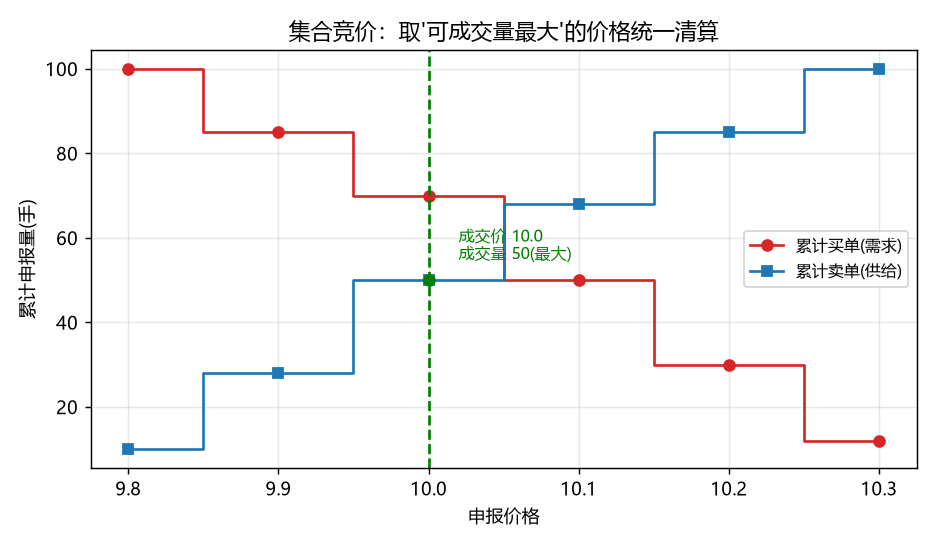
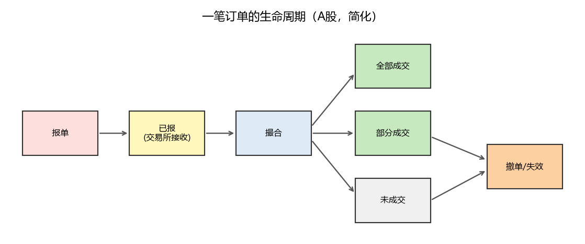
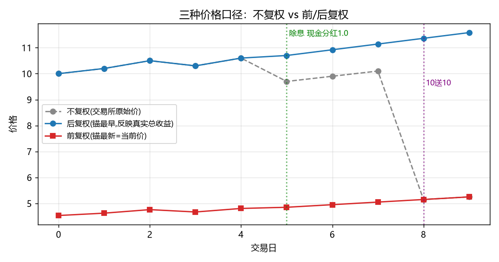
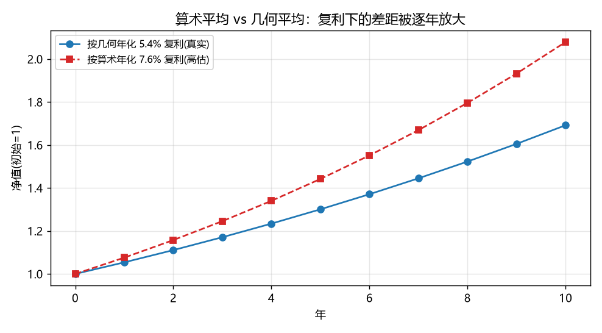
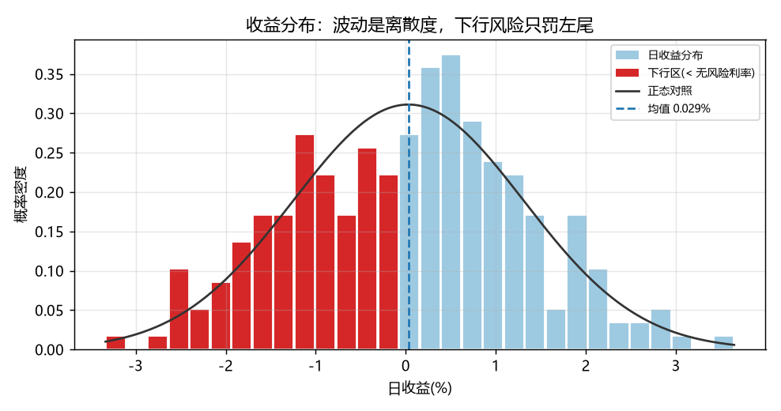
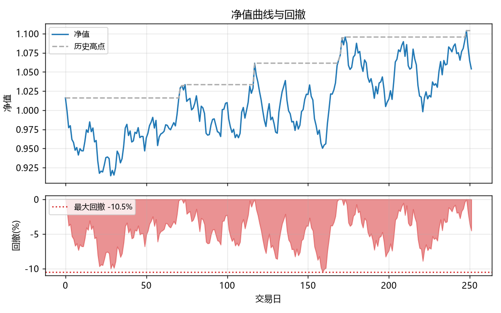
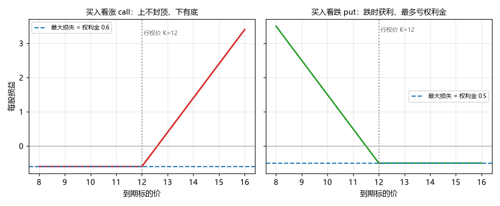
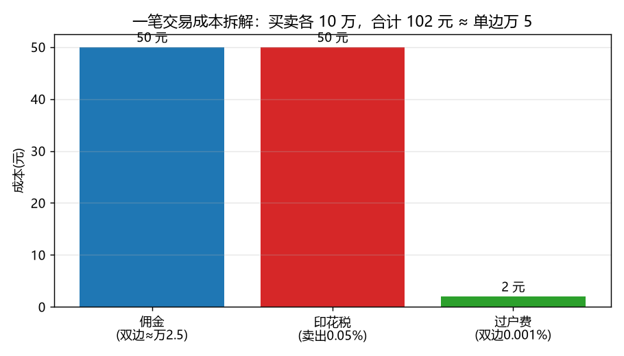

# ch0F 金融市场与工具基础（零基础地基章）

!!! abstract "本章定位"
    这是全书的**金融地基**，排在所有技术章之前。后面要讲的因子、机器学习、深度学习、强化学习、大模型，本质都是在回答一些**金融问题**——但如果连"市场怎么运作、钱怎么赚怎么亏、一个价格序列背后藏着哪些坑"都不清楚，再强的模型也只是在错误的数据上算出漂亮的废话。
    本章对每个概念都坚持两条腿走路：**先给生活化直觉，再给专业定义、公式与边界条件**，宁详勿略。读完它，你应当能看懂一张行情表、一份财报摘要、一笔交易的成本明细，并知道这些东西在后续章节里会变成模型的什么输入、什么标签、什么约束。

---

> **本章你将学到**
>
> - 一级/二级市场、交易所撮合、连续竞价与集合竞价、流动性到底指什么；
> - 账户与委托类型、做多做空、融资融券、T+1，以及一笔订单的完整生命周期；
> - 价格与收益的各种口径——**复权**、算术/几何/对数收益、年化与复利，以及它们最容易坑人的地方；
> - 风险的金融含义：波动率、下行风险、最大回撤、风险溢价、无风险利率与折现；
> - 公司与估值：财报三表、市值、PE/PB/PEG/EV、ROE 杜邦分解；
> - 工具谱系：股票/指数/ETF/LOF、可转债、期货、期权；
> - A 股参与者生态与**经核验的现行交易制度**（涨跌停、印花税、过户费、融券新规等）；
> - 怎样把一个"金融问题"翻译成本书后面章节能计算的问题。
>
> **前置知识**：会一点 Python 与基础统计（均值、方差、相关系数）即可；**不要求任何金融背景**，本章就是来补这块的。
>
> **本章新增依赖 + 安装命令**：仅核心栈（`numpy / pandas / matplotlib`，环境已含）。可选的真实数据小例用到 `akshare`（已在环境内，无网络会自动跳过）。无需 `uv sync --group ...`。
>
> **数据来源**：核心演示用**自洽的合成数据**（离线、可复现）；末尾附一个可选的 akshare 真实数据小例，带快照兜底，正式的"取数+快照"范式留到 ch01。
>
> **对应综述章节**：综述 01（量化全景与简史，含 1.5 A 股制度特异性）；术语逐条详解见 [附录 D 金融概念词典]。
>
> **运行状态**：配套**完整脚本** [`code/ch0F/finance_basics.py`](code/ch0F/finance_basics.py) —— **已实跑 ✅**（本仓库 uv 环境 `uv run` 通过，关键数值与全部 8 张教学图见下文；可选真实数据小例无网络时友好跳过，不影响核心演示）。脚本随站点发布，可在线查看或下载；正文里的代码块都是它的**讲解片段**（同源摘录）。

!!! tip "怎么读这一章"
    它**不需要从头背到尾**。第一遍通读建立全局直觉即可；后面写到具体技术时，遇到不熟的金融名词再回来查对应小节，或翻 [附录 D 金融词典]。每个技术章开头还会有一节「💡金融前置知识」，把那一章要用到的概念再讲一遍并回链到这里。
    正文里会频繁出现 `ch03`、`ch13` 这类**前向指引**，告诉你"这个概念以后在哪深入"——**第一遍读到时可以直接跳过这些编号**，不必现在就翻过去，它们只是路标。

---

## 0F.1 市场怎么运作：从一级市场到撮合成交

### 一级市场 vs 二级市场：钱到底流向谁

!!! note "生活化直觉"
    把一家公司想成汽车厂。**一级市场**就是车厂第一次把新车卖给 4S 店——钱进了车厂口袋（公司**融到资**）。**二级市场**是车主之间转手二手车——钱在买卖双方之间流动，**车厂一分钱也拿不到**。

- **一级市场（发行市场）**：公司通过 IPO（首次公开发行）、增发、配股等方式**首次卖出股票/债券换取资金**，资金流向**发行人（公司）**。投行（卖方）在这里做承销定价。
- **二级市场（流通市场）**：已发行的证券在投资者之间转手，资金在**交易对手之间**流动。我们做量化交易，**99% 的活动都发生在二级市场**。
- **专业边界**：二级市场价格虽不直接给公司输血，却通过**估值、再融资能力、股权激励、控制权**深刻影响公司——这是"市场有效性"讨论的根（综述 03 讲 EMH）。

### 交易所与撮合：价格优先、时间优先

中国大陆股票主要在三家交易所交易：**上海证券交易所（沪市）、深圳证券交易所（深市）、北京证券交易所（北交所）**；此外有港股（港交所，可经沪深港通参与）。交易所的核心是一台**撮合引擎（matching engine）**，遵循两条铁律：

1. **价格优先**：买单出价越高越优先成交，卖单要价越低越优先。
2. **时间优先**：同价位，先到的订单先成交。

这套机制叫**订单驱动（order-driven）/ 竞价市场**——价格由买卖盘口自发形成，没有指定的"坐市者"报价做市。与之相对的是**报价驱动（quote-driven）/ 做市商市场**，由**做市商（market maker，做市商：持续向市场报出买价和卖价、随时准备成交的机构）**用自有库存吃单、赚买卖价差为生（代价是承担库存风险与"被更聪明的对手单边吃掉"的逆向选择风险）。A 股股票以竞价为主，**科创板引入了做市商机制**，债券、外汇、部分 ETF 也有做市。

!!! quote "思辨：机制是中性的，价格不是"
    撮合规则确实中性、机械，但**别因此以为价格是客观、无博弈的产物**。同一套规则下，参与者会挂单又撤单、对敲、拉抬尾盘——这正是后面 0F.7 要讲的游资与龙虎榜生态的前奏。更深一层是索罗斯的**反身性（reflexivity）**：价格不只是"反映"基本面，价格本身会**反过来改变**基本面（股价涨高 → 公司更易再融资、做股权激励 → 基本面真的变好）。市场不是一面照实景的镜子，而是一面**会被自己影像改变的镜子**。这是量化"对抗性"警戒线的哲学根：**规律会因为被你发现、被很多人交易而失效**。

### 集合竞价 vs 连续竞价

!!! note "生活化直觉"
    **集合竞价**像拍卖会休市后的"统一清算"：大家把出价都写下来，到点了用**一个价格**让尽可能多的人成交。**连续竞价**像菜市场：买卖双方一对上价就立刻成交，价格随时在变。

A 股一个交易日的时间表（以沪深为例）：

| 时段 | 机制 | 说明 |
|---|---|---|
| 9:15–9:25 | 开盘集合竞价 | 9:20–9:25 不可撤单；产生**开盘价** |
| 9:30–11:30、13:00–14:57 | 连续竞价 | 逐笔撮合，价格连续变动 |
| 14:57–15:00 | 收盘集合竞价 | 产生**收盘价**（沪深主板、创业板、科创板均有） |

集合竞价的定价原则是**最大成交量**：把所有买卖申报汇总成"需求向下、供给向上"两条阶梯线，选那个**可成交量最大**的价格统一清算。



*图：红线是累计买单（价越低想买的越多），蓝线是累计卖单（价越高想卖的越多）；每个价格的可成交量 = 两者取小，取其最大处即集合竞价成交价（本例 10.0 元、成交 50 手）。* 理解它对做"收盘价相关"的策略很重要（Kaggle 的 *Optiver – Trading at the Close* 竞赛专门预测收盘集合竞价，见 ch04/ch06 取材）。

### 盘口、买卖价差与流动性

- **盘口（order book）**：实时挂出的买/卖各档价格与数量（A 股常见"五档"）。最高买价（bid）与最低卖价（ask）之间的差叫**买卖价差（bid–ask spread）**。盘口是**动态**的——挂单会被不断撤掉、补上，大单还可能拆成小单慢慢喂（冰山单，ch16 细讲），所以"五档"只是某一瞬间的快照。
- **流动性（liquidity）**：能**多快、以多小的价格代价、成交多大的量**而不显著推动价格。它不是单一数字，常用这些代理指标衡量：

    - 买卖价差（越窄越好）；
    - 盘口深度（各档挂单量）；
    - 换手率 = 成交量 / 流通股本；
    - **Amihud 非流动性**：$\text{ILLIQ} = \dfrac{|r_t|}{\text{成交额}_t}$——直白读法是"**成交 1 元钱能让价格动多少**"，动得越多说明市场越"薄"、越不流动（越大越不流动）。

!!! warning "为什么量化必须在意流动性"
    流动性差 ⇒ 你的买卖会**自己推动价格**（冲击成本），回测里看似赚钱的信号，真金白银下单时利润被滑点吃光。流动性直接决定一个策略的**容量（capacity）**：小资金能跑的策略，大资金未必能跑。冲击成本与容量在 ch04（回测引擎）、ch13（组合实战）、ch16（执行算法）反复出现。

---

## 0F.2 账户与委托：做多、做空与一笔订单的一生

### 账户类型

要交易，先得有个"**能干什么**"的账户——能不能借钱、能不能做空，取决于账户类型（"做多/做空/融券"等词见下文小节，这里先有个印象）：

- **普通账户**：现金买卖，只能**做多**（先买后卖）。
- **信用账户（两融账户）**：可**融资**（借钱买）与**融券**（借券卖空），需满足门槛（**前 20 个交易日日均托管资产 ≥ 50 万元，且 6 个月以上 A 股交易经验**等），单独开立。
- **衍生品账户**：股指期货、商品期货在期货公司开户；期权另需开通相应权限与适当性测评。

### 委托类型：限价单 vs 市价单

!!! note "生活化直觉"
    **限价单**像在二手平台挂"非￥50 不卖"，能等到好价但可能成交不了；**市价单**像走进店里"现价立刻买"，一定成交但价格随行就市。

- **限价单（limit order）**：指定价格或更优才成交。挂在盘口上为别人提供流动性。
- **市价单（market order）**：以当前最优对手价立即成交。A 股的"市价"有若干受控变体（对手方最优、本方最优、最优五档即时成交剩余撤销、全额成交或撤销等），且**不允许隔夜挂市价**，本质是为防止极端价格成交。
- 委托数量：A 股以**手**为单位，1 手 = 100 股，买入须为 100 股整数倍（卖出可不足 100 股一次性卖出；科创板/北交所申报数量规则略有不同）。

### 订单的生命周期

一笔订单的状态机大致是：



*图：报单 →（交易所接收）已报 → 撮合，按价格/数量是否满足分流为 全部成交 / 部分成交 / 未成交；未成交或部成的剩余单可撤单，否则当日收盘自动失效。* 此外，价格超出涨跌停、数量不是 100 股整数倍等会被直接判为**废单/拒单**（连"已报"都进不去）。

理解这个状态机，是 ch16（事件驱动实盘系统）里 `on_order` / `on_trade` 回调与 OMS（订单管理）的基础。**回测里我们常把它简化成"信号 → 下一根 K 线成交"**，但真实系统必须处理部成、撤单、拒单。

### 做多 vs 做空

| | 做多（long） | 做空（short） |
|---|---|---|
| 操作 | 先买后卖 | 先（借券）卖，后买回还券 |
| 何时赚 | 价格**上涨** | 价格**下跌** |
| 最大亏损 | 本金（跌到 0） | **理论无限**（价格可无限上涨） |
| A 股途径 | 普通账户即可 | 仅**融券**（个股）/ 股指期货、期权（对冲） |

> **对冲（hedge）**：再开一个**方向相反**的仓位，抵消掉你不想要的那部分风险。例如选了一篮子你看好的股票（赌选股能力），同时卖空等市值的股指期货抵消"大盘整体涨跌"的影响——这样赚的是"跑赢大盘"而非"大盘上涨"，即**市场中性**。

!!! note "做空的直觉"
    做空 = 找券商**借**一件你认为会跌价的商品，**现在高价卖掉**，等跌了**低价买回来还**给券商，赚差价。风险在于：你赌它跌，它却涨——而价格上涨没有上限，所以做空的潜在亏损理论上无限，必须用保证金和强平来兜底。

### 融资融券（两融）与杠杆

- **融资（margin buy）**：抵押保证金向券商借钱买股票 = **加杠杆做多**。
- **融券（short sell）**：借入股票卖出 = **做空**。
- **关键参数**：保证金比例、**维持担保比例**（= 担保物市值 / 负债；跌破阈值先收到追保通知、再跌触发**强制平仓**。典型阈值因券商而异，常见追保线约 150%、平仓线约 130%）。杠杆把盈亏同步放大——这是"爆仓"的来源。

!!! danger "A 股做空的现实约束（经核验，2024 年大幅收紧）"
    A 股本就没有自由做空机制，2024 年监管进一步收紧融券与**转融券**[R73]：

    > **先厘清两个词**：**限售股**＝IPO/定增等取得、约定期限内**不得在二级市场卖出**的股票（像"锁仓期"的股份），解禁后才流通。**转融券**＝券商自有可借的券不够时，**向中证金融（转融通平台）借券、再转借给客户**做空——它是融券做空的"上游批发"环节，掐断它，下游融券就没了券源。

    - **2024-01**：全面暂停**限售股出借**；转融券约定申报由"实时可用"改为"次日可用"；
    - **2024-07**：经批准**全面暂停转融券业务**，并上调融券保证金比例（融券保证金最低比例由 80% 上调至 100%，私募 100%→120%）；
    - 到 2024 年中，融券与转融券规模分别累计下降约 64% 与 75%；**2024 年 10 月转融券余额清零**。

    **对量化的含义**：在 A 股，**不要默认你的策略能自由做空个股**。多空对冲、做空选股在 A 股落地非常受限；纯多头（long-only）+ 用股指期货对冲市场 **Beta（贝塔：组合随大盘涨跌的放大倍数，$r_i=\alpha+\beta r_m+\varepsilon$ 中的 $\beta$；Beta=1 即与大盘同步，"对冲市场 Beta"就是剔掉随大盘的部分、只留选股带来的超额 alpha）**，往往才是现实可行的形态（ch13 组合实战会专门处理 long-only 与约束优化）。

### T+1 交收制度

!!! note "生活化直觉"
    A 股股票是 **T+1**：**今天买入的股票，要到下一个交易日才能卖出**（资金交收也是 T+1）。像网购"今天下单，明天才到货，到货才能转手"。

T+1 自 1995 年沿用至今，直接影响策略形态：

- **不能日内高抛低吸同一仓位**（个股）；想做日内，得靠**可转债、部分 ETF**等 T+0 品种（A 股股票坚持 T+1，主要出于抑制过度投机、保护中小投资者的考量）。
- 量化回测的头号红线由此而来：**信号用 $t$ 日收盘价产生，成交记在 $t+1$ 日开盘**，杜绝"用今天收盘价在今天成交"的未来函数（全书贯穿红线 1，ch00 起即遵守，ch04 把制度做进引擎）。

!!! quote "思辨：制度不只是限制，它'长出'生态"
    T+1、涨跌停看似只是约束，但更深一层：**它们塑形了哪些策略能在这个市场里存在**。涨跌停催生了"封板—连板—打板"的博弈生态，T+1 把日内策略逼向可转债与 ETF。A 股的龙虎榜、双低转债、打板情绪周期等"特色玩法"（ch15）不是孤立技巧，而是从制度约束里**涌现**出来的——这也提醒你：制度一旦变化（如 1995 年定下的 T+1 若某天调整），整类策略的生存空间都会随之重画。

---

## 0F.3 价格与收益：复权、收益口径与复利

### OHLCV 与 K 线

最基础的行情单位是日（或分钟）K 线：**开盘价 O、最高价 H、最低价 L、收盘价 C、成交量 V**（再加成交额）。我们绝大多数特征和标签都从这几列派生。但在用它们之前，必须先过**复权**这一关——这是新手最容易踩的坑。

### 复权：除权除息后如何还原真实收益（重点）

!!! note "生活化直觉"
    你持有的股票"10 送 10"（每股拆成 2 股），第二天行情软件上股价"腰斩"了——你亏了吗？**没有**：你的股数翻倍，总市值不变。如果直接拿这个"腰斩"的价格算收益，模型会以为发生了 −50% 的暴跌。**复权**就是把分红、送股这些"公司行为"的影响抹平，还原出持有人**真实**经历的财富曲线。

公司行为主要有三类：**现金分红（除息）**、**送股/转股（除权）**、**配股**。它们都会在除权除息日让"不复权"价格**人为跳空**。三种价格口径：

- **不复权**：交易所原样打印的价格。除权除息日有"假跳空"，**只适合看当时盘面真实成交价**（如打板封单价——**打板**＝在个股涨停瞬间挂单买入"封板"，赌次日溢价的短线打法；**封单**＝堆在涨停价上未成交的买单/跌停价上的卖单，封单金额越大代表买卖意愿越坚决，是情绪强度指标，见 ch15）。
- **后复权**：以**最早**一天为锚，向后把分红/送股按再投资还原。序列连续、单调反映**真实总收益**，适合算长期收益、喂模型。
- **前复权**：以**最新**一天为锚（= 当前真实价格），把历史价向下还原。画近端图最直观，是行情软件默认。

配套脚本构造了一段含"第 5 天现金分红 1.0 元 + 第 8 天 10 送 10"的行情，三种口径对比如下：



*图：灰色虚线（不复权）在第 8 天 10 送 10 处"假腰斩"；蓝线（后复权）连续上行，才是持有人真实经历的财富；红线（前复权）锚定在当前真实价格。*

脚本算出的**总收益**对比极具说服力：

```text
不复权口径的"总收益" = -47.50%   ← 把 10送10 看成了腰斩，严重失真
复权后的真实总收益   = +15.82%   ← 含分红再投资、剔除送股影响，才是真实赚到的
```

底层逻辑只有一行——持有人的**真实日收益因子**把当天落袋的现金分红和拆股后的股数都算进财富：

```python
# 普通日:        g = raw_t / raw_{t-1}
# 除息日(分红 D): g = (raw_t + D) / raw_{t-1}     # 价格虽跌，但拿到了现金
# 送股日(拆 s 倍): g = (raw_t * s) / raw_{t-1}     # 价格虽减半，但股数翻倍
for t in range(1, n):
    g[t] = (raw[t] * split[t] + cash_div[t]) / raw[t - 1]
hfq = raw[0] * np.cumprod(g)        # 后复权 = 锚最早，向后累乘真实收益因子
qfq = hfq * (raw[-1] / hfq[-1])     # 前复权 = 整体缩放使最新一天 = 当前真实价格
```

把上面三行翻成白话：**后复权**＝假设你从第 0 天起就持有、并把每天的真实收益（含分红再投资、送股增股）连乘起来，所以起点用真实价、之后只乘收益因子 `g`，曲线连续；**前复权**＝把整条后复权曲线**等比例缩放**，让最后一天对齐"今天的真实价格"。注意这一步**只是乘了一个常数 `raw[-1]/hfq[-1]`，不改变任何一天的收益率**（前后两天相除时常数约掉了）——所以前/后复权算出的收益**完全一样**，差别只在"价格的绝对水平锚在哪一端"。

!!! quote "思辨：复权价不是'更真的价格'，而是一张'为某个问题画的地图'"
    我们很容易把后复权曲线当成"客观真相"。但更准确的说法是：**没有口径无关的'真实价格'，只有'为了回答什么问题、该选哪张地图'**。后复权这张地图擅长回答"长期总收益是多少"，却会扭曲"当时盘面真实成交价"；要判断打板封单、要对当日真实价位下单，就得换回不复权这张地图。**度量动作本身在建构你看到的"现实"**——这正是新手最常见的实盘亏损来源之一：拿后复权价去做需要真实盘口价的决策。地图与疆域，不可混为一谈。

!!! warning "复权的工程纪律"
    - **算收益、做回测、喂模型，一律用复权价**；不复权价只用于"看当时真实盘面"。
    - 全程**口径一致**：训练、回测、实盘要么都用前复权、要么都用后复权，不能混。
    - **前复权的历史值会随新分红而变化**（锚是最新价），所以做"可复现的历史回测"时，后复权或"复权因子 + 不复权价"更稳。这与 ch01 的"数据快照 / point-in-time"纪律直接相关。
    - **它是"理想财富"，不是字面到手**：后复权隐含"分红立即、无税、无摩擦地再投资"，现实里有红利税、再投资时点、零股等摩擦，所以复权收益是个**上界近似**。
    - 完整代码见 [`code/ch0F/finance_basics.py`](code/ch0F/finance_basics.py)（随站点发布，可在线查看/下载）。

### 简单收益 vs 对数收益：可加还是可乘

- **简单收益**：$r_t = \dfrac{P_t}{P_{t-1}} - 1$。直觉就是"涨跌百分比"。**跨资产可加**（组合收益 = 各持仓收益的加权和），所以做**截面/组合**时用它。
- **对数收益**：$\tilde r_t = \ln\dfrac{P_t}{P_{t-1}} = \ln(1+r_t)$。**跨时间可加**（$\sum_t \tilde r_t = \ln\frac{P_T}{P_0}$），所以做**时序累计**时用它，且更接近正态、便于建模。

对应的讲解片段（完整脚本的真实子集）：

```python
daily_log = np.log1p(daily_simple)        # = ln(1+r)，比 np.log(1+r) 在小收益下更稳
# 可加性：逐日对数收益相加 == 区间对数收益（简单收益做不到这点）
assert np.isclose(daily_log.sum(), np.log(nav[-1]))
```

脚本里的自检印证了可加性（逐日对数收益之和 = 区间对数收益）：

```text
对数收益可加性自检：逐日对数收益之和 = ln(终值)  →  0.0526 == 0.0526
```

!!! tip "一句话记忆"
    **时间维度求和用对数收益，资产维度求和用简单收益。** 二者在收益很小时近似相等（$\ln(1+r)\approx r$），但跨长周期、大涨大跌时差异显著，不能混用。

### 算术平均 vs 几何平均：哪个才是"真实增长速度"

!!! note "经典陷阱"
    第一年 +50%、第二年 −50%，算术平均 = 0%，听起来"不赚不亏"。但 1 元 → 1.5 元 → 0.75 元，**实际亏了 25%**。真实增长速度是**几何平均**：$\sqrt{1.5\times0.5}-1 = -13.4\%$/年。

- **算术平均**：$\bar r_A = \frac1T\sum_t r_t$，会**系统性高估**长期增长。
- **几何平均**：$\bar r_G = \left(\prod_t (1+r_t)\right)^{1/T} - 1$，与**终值自洽**，是真正的复利速度。
- **波动拖累（volatility drag）**：二者之差约等于方差的一半，

$$\bar r_G \approx \bar r_A - \tfrac12\sigma^2.$$

    这是对 $\ln(1+r)$ 做二阶泰勒展开得到的**近似**（收益越小越准），**不是恒等式**；收益越大、越偏离对数正态，残差越大。精确关系只有 $1+\bar r_G=\big(\prod_t(1+r_t)\big)^{1/T}$。下面日频小收益下"恰好吻合"，正是因为 $r$ 很小。

对应讲解片段与脚本输出：

```python
arith_mean = daily_simple.mean()             # 算术平均
geo_mean   = nav[-1] ** (1 / TRADING_DAYS) - 1   # 几何平均 = 终值开 T 次方根 - 1（不是对收益直接平均！）
drag       = arith_mean - geo_mean
drag_approx = 0.5 * daily_simple.var()       # ≈ 方差/2
```

```text
日算术平均收益 = +0.0291%   ← 简单求平均，高估长期增长
日几何平均收益 = +0.0209%   ← 与终值自洽，才是真实复利速度
波动拖累 = 算术 - 几何 = 0.0082%  ≈ 方差/2 = 0.0082%  (二者吻合，因日收益很小)
```



*图：同一组日收益，按算术年化（红虚线）与几何年化（蓝实线）做复利外推，多年后差距被复利显著放大。*

!!! warning "波动拖累的金融含义（很重要）"
    **波动本身会吃掉复利。** 两个策略期望收益相同，波动大的那个长期净值更低。这就是为什么量化如此看重"风险调整收益"而非裸收益——**控制波动 = 保护复利**。这条直觉贯穿 ch02（组合优化最小化方差）、ch04（绩效评估）、ch13（风险管理）。

### 年化与复利

- **年化收益（几何）**：把周期收益复利放大到一年。A 股一年约 **252 个交易日**，$\text{年化} = (1+\bar r_G)^{252}-1$。
- **年化波动率**：在收益独立同分布假设下用**平方根法则**：$\sigma_{\text{年}} = \sigma_{\text{日}}\sqrt{252}$。

脚本输出：年化波动率 = **20.35%**（贴近真实股票量级）。

- **复利的力量（72 法则）**：年化 $r$ 下，本金翻倍约需 $72/(100r)$ 年——年化 8% 约 9 年翻倍。复利是长期投资的核心，也是波动拖累值得斤斤计较的原因。

!!! tip "本节带走（0F.3 最容易混的三句话）"
    1. **算收益先复权**：前/后复权收益一样，只是价格水平锚在哪端不同；不复权只看真实盘口价。
    2. **时间维度求和用对数收益，资产维度求和用简单收益**。
    3. **几何平均才是真实复利速度**；波动会拖累复利（$\bar r_G\approx\bar r_A-\sigma^2/2$）。

---

## 0F.4 风险与收益的金融含义

### 风险 ≠ 亏损，风险 = 不确定性

!!! note "生活化直觉"
    天气预报说"明天气温 10–30 度"和"明天 19–21 度"，后者**更可预测、更低风险**。金融里的"风险"首先指**结果的不确定性（波动）**，而不只是"会亏钱"。

!!! quote "思辨：能写进概率分布的是'风险'，写不进的是'不确定性'"
    我们马上要用波动率、方差给风险贴上数字标签。但请先记住一个更深的区分（奈特 Frank Knight）：**能估出概率分布、能算方差的，叫"风险（risk）"；连"会发生什么"都想不到、无法赋概率的，叫"不确定性（uncertainty）"**——2015 年股灾、2020 年负油价、黑天鹅，多属后者。本章教你**度量风险**，但真正让人爆仓的，往往是被模型默默当成"零概率"的不确定性。**你所有的风险指标，都建立在"历史分布代表未来"这个未必成立的假设上**（非平稳性，ch04 详谈）——记住这一点，比记住任何公式都重要。

- **方差 / 标准差（波动率）**：$\sigma = \sqrt{\mathbb{E}[(r-\bar r)^2]}$，衡量收益围绕均值的离散程度。它是组合理论（ch02）和绝大多数风险模型的基石。
- **缺陷**：波动率把"涨得多"也当成风险来罚。但投资者其实只怕"跌"。于是有：
    - **下行波动 / 半方差**：只对低于某阈值（MAR，如 0 或无风险利率）的收益求离散度；
    - **回撤**（见下）；
    - **VaR / CVaR**（在险价值：未来一段时间"最坏 5%/1% 情形下亏多少"，ch13 展开）。



*怎么看：浅蓝是日收益分布、黑线是同均值同方差的正态对照——一眼看出"波动 = 分布有多宽"；红色左尾（低于无风险利率的部分）才是"下行风险"惩罚的区域；蓝虚线是均值。* 脚本对比（同一收益序列）：年化总波动 **20.35%**，年化**下行波动 14.28%**——只罚左尾，故 ≤ 总波动。

!!! warning "下行波动的口径要交代清楚"
    下行波动（target semideviation）= $\sqrt{\frac1T\sum_t[\min(r_t-\text{MAR},0)]^2}$，本书取 **MAR = 无风险利率、分母用全样本期数 $T$**（达标日记 0）。这样它必然 **≤ 总波动**。⚠️ 若把分母错用成"负收益的天数"，会算出"下行波动 > 总波动"的反直觉结果——那是口径错误，不是普遍规律。

### 回撤与最大回撤（MDD）

!!! note "生活化直觉"
    回撤 = 从你账户的**历史最高点**到当前的回落比例。最大回撤（Max Drawdown, MDD）= 这段历史里最深的那次回落。它回答："我最惨的时候，浮亏过多少？"——这往往是投资者**能不能拿得住、会不会被强平**的决定性指标。

$$\text{回撤}_t = \frac{\text{NAV}_t}{\max_{s\le t}\text{NAV}_s} - 1 \le 0, \qquad \text{MDD} = \min_t \text{回撤}_t.$$



*怎么看：上图蓝线是净值、灰虚线是"历史最高水位"（只升不降）；净值每次跌破灰线，下图就出现一段红色回撤，**两图上下对齐看**——回撤最深的谷底（红虚线，约 −10.5%）正对应净值跌离前高最远处。*

回撤的实现是一个极其常用的习惯用法（讲解片段）：

```python
peak = np.maximum.accumulate(nav)   # 逐日"历史最高水位"：np.maximum.accumulate 让每一点取到目前为止的最大值
drawdown = nav / peak - 1           # 回撤序列（≤0）
mdd = drawdown.min()                # 最大回撤
```

脚本输出：最大回撤 = **−10.48%**（在第 159 个交易日触底）。一条 +5% 年收益的曲线，中途也可能浮亏 10%——这就是"纸面收益"与"持有体验"的差距。

### 风险溢价、无风险利率与折现

!!! note "生活化直觉"
    今天给你 100 元，和一年后给你 100 元，你选哪个？当然今天——因为钱能生息、且未来有不确定性。"未来的钱要打个折才能和今天比"，这就是**折现**的全部直觉。

- **无风险利率 $r_f$**：几乎无违约风险的收益基准（国债收益率、SHIBOR 等）。它是一切估值与风险调整的"零点"。
- **风险溢价（risk premium）**：承担风险所要求的**超额补偿**。股票相对国债的长期超额收益叫**股权风险溢价（equity risk premium）**——它是股票长期上涨的根本原因，也是 CAPM/因子模型的出发点（综述 03）。
- **折现（discounting）/ 时间价值**：未来的 1 元不如现在的 1 元值钱，要按折现率打折回今天：

$$\text{现值 } PV = \frac{FV}{(1+r)^t}.$$

折现是 DCF 估值、债券定价、期权定价的共同底层。

!!! tip "为什么加息会砸成长股"
    成长股的价值更多来自**遥远未来**的现金流（分母 $(1+r)^t$ 里的 $t$ 很大），对折现率 $r$ 的变化**更敏感**；利率一升，远期现金流的现值缩水更狠。所以同样加息，高估值成长股往往比低估值价值股跌得多——这不是情绪，是折现公式的数学必然。

### 风险厌恶与风险调整收益

理性投资者**风险厌恶（risk-averse）**：期望收益相同，偏好波动更小者（效用函数是凹的）。于是评价策略要看"每单位风险换来多少收益"：

| 指标 | 公式（年化） | 一句话 | 边界/陷阱 |
|---|---|---|---|
| **夏普比率** Sharpe[R02] | $\dfrac{\mathbb{E}[r]-r_f}{\sigma}$ | 每单位**总波动**的超额收益 | 假设收益近正态；惩罚上行波动；高频/厚尾下失真 |
| **索提诺比率** Sortino | $\dfrac{\mathbb{E}[r]-r_f}{\sigma_{\text{下行}}}$ | 每单位**下行波动**的超额收益 | 只罚亏损，分母更小→通常 > 夏普 |
| **信息比率** IR[R16] | $\dfrac{\mathbb{E}[r-r_b]}{\sigma(r-r_b)}$ | 每单位**跟踪误差**的超额（相对基准） | 主动管理核心；依赖基准选择 |

> 表中两个新词：**跟踪误差** = 策略相对基准的超额收益 $(r-r_b)$ 的波动（IR 的分母）；**厚尾（fat tail）** = 极端大涨大跌比正态分布预言的更频繁——这正是夏普"假设近正态"在现实中失真的原因（ch04 / 综述 07 详谈）。

脚本输出（$r_f=2\%$）：夏普 **0.26**、索提诺 **0.37**（索提诺 > 夏普，因下行波动 < 总波动，正符合"对上行更宽容"）。这些指标在 ch04（绩效评估）会从零完整实现，这里先建立**金融含义**：**裸收益没有意义，必须除以你为它承担的风险。**

!!! tip "本节带走（0F.4 风险的四把尺子）"
    1. **风险首先是不确定性**（波动），不只是亏损；能量化的是风险，量化不了的是不确定性。
    2. **总波动 vs 下行波动**：前者上下都罚，后者只罚左尾、更贴"痛感"。
    3. **最大回撤**衡量"最惨浮亏"，决定你拿不拿得住；**风险调整收益**（夏普/索提诺/IR）才是评价策略的正确尺度。
    4. 所有这些都假设"未来像过去"——这个假设失效时，正是风险最大时。

---

## 0F.5 公司与估值：读懂一家公司值多少钱

!!! note "生活化直觉"
    买股票，本质是**买下一家公司的一小块所有权**。你在二手平台买手机会看成色、电池、保修；买公司当然要看它的"成色报告"——财报。不看财报就买股票，约等于不看配置就买电脑。

!!! quote "思辨：价格 vs 价值"
    巴菲特说"**价格是你付出的，价值是你得到的**"。本节教你算 PE/PB/ROE，但要清醒：这些倍数衡量的是"**市场此刻愿意为价值付的价格**"，不等于价值本身。估值的全部张力就在于——价格围绕一个**谁也无法直接观测**的"内在价值"上下波动，而你赌的正是这道缝隙。这也解释了价值因子为何"时灵时不灵"：你测的是价格对一个不可观测量的偏离，而非偏离本身。

价值投资、基本面因子、财务质量因子（如 ROE、F-Score）都建立在财务报表之上。哪怕你只做量价策略，也要懂估值，才能理解"价值/成长"风格因子（综述 04、ch03）。

### 财报三表

!!! note "生活化直觉"
    - **资产负债表**＝某一时刻的"**家底照片**"：你有多少资产、欠多少债、净身家多少。
    - **利润表**＝一段时间的"**这一年挣了多少**"流水账。
    - **现金流量表**＝同一段时间"**钱实际进出**多少"——利润是会计口径，现金才是真金白银。

| 报表 | 性质 | 核心恒等/科目 |
|---|---|---|
| 资产负债表 | 时点**存量** | **资产 = 负债 + 所有者权益**；货币资金、应收、存货、商誉、有息负债 |
| 利润表 | 区间**流量** | 营业收入 − 成本费用 = 营业利润 → 净利润；毛利率、净利率 |
| 现金流量表 | 区间**流量** | 经营/投资/筹资三类现金流；经营现金流应与净利润互相印证 |

!!! warning "为什么要看现金流（以及：财报是公司'讲'给你听的故事）"
    "有利润没现金"是财务暴雷的经典前兆（利润靠应收账款堆出来，钱却收不回）。更要警惕：**财报是公司按会计规则"讲"出来的故事，存在盈余管理乃至造假的空间**——质量因子（"经营现金流/净利润""应计利润"等）之所以有效，正是因为有人会粉饰故事，而现金流比利润更难粉饰。把这种"识别故事真伪"的洞察工程化，就是 ch03/ch06 的因子。

### 市值与估值倍数

- **总市值** = 股价 × 总股本；**流通市值** = 股价 × 流通股本。市值是"规模因子"（小盘/大盘）的来源。
- 常用估值倍数：

| 指标 | 公式 | 直觉 | 适用 / 陷阱 |
|---|---|---|---|
| **PE 市盈率** | 价 / 每股收益(EPS) | 按当前盈利"回本"要几年 | 亏损公司无意义；周期股低 PE 是陷阱 |
| **PB 市净率** | 价 / 每股净资产(BPS) | 为每 1 元净资产付多少 | 银行/地产/重资产常用 |
| **PEG** | PE / 盈利增速 | 成长性调整后的 PE | 增速预测不可靠则失真 |
| **EV/EBITDA** | 企业价值 / 息税折旧前利润 | 跨资本结构可比 | 重资产/并购分析常用 |
| **股息率** | 每股分红 / 价 | 现金回报 | 高股息 ≠ 安全，需看可持续性 |

> 两个缩写展开：**EV（企业价值）= 总市值 + 净负债（有息负债 − 现金）+ 少数股东权益**，相当于"整体收购这家公司要付的总价"；**EBITDA = 息税折旧摊销前利润**（净利润加回利息、税、折旧、摊销）。EV/EBITDA 因为"分子含负债、分母剔除资本结构差异"，所以能跨不同杠杆水平的公司横向比较。

### ROE 与杜邦分解（重点）

**净资产收益率 ROE = 净利润 / 净资产**，回答"股东每 1 元本金，一年赚回多少"，是巴菲特最看重的单一指标。**杜邦分解**把它拆成三块生意逻辑：

$$\text{ROE} = \underbrace{\frac{\text{净利润}}{\text{营收}}}_{\text{净利率}} \times \underbrace{\frac{\text{营收}}{\text{总资产}}}_{\text{资产周转率}} \times \underbrace{\frac{\text{总资产}}{\text{净资产}}}_{\text{权益乘数(杠杆)}}.$$

杜邦三因子怎么从财报科目算出来（讲解片段）：

```python
net_margin        = net_income / revenue   # 净利率：每 1 元营收挣多少
asset_turnover    = revenue / assets       # 资产周转率：每 1 元资产撬动多少营收
equity_multiplier = assets / equity        # 权益乘数：杠杆（总资产 / 净资产）
roe = net_margin * asset_turnover * equity_multiplier   # 三者相乘 = ROE
```

脚本用一家"教科书公司"演示（数值取整以看清恒等关系）：

```text
PE = 15.0 倍   PB = 2.40 倍   ROE = 16.0%
恒等关系自检：PB = PE × ROE  →  15.0 × 16.0% = 2.40  == PB 2.40   ✓
杜邦分解  ROE = 净利率 × 资产周转率 × 权益乘数
         16.0% = 8.0% × 0.833 × 2.4   ✓
```

!!! tip "杜邦分解的金融洞察"
    同样是 16% 的 ROE，可以由**高毛利**（白酒：净利率高、周转慢）、**高周转**（零售：薄利多销）或**高杠杆**（银行：权益乘数大）驱动，三者的**风险含义截然不同**——高杠杆的 ROE 在景气下行时最脆弱。这正是"把财务比率拆解成可解释因子"的价值。另外注意恒等式 **PB = PE × ROE**：高 PB 要么是市场给了高 PE（看好成长），要么是公司 ROE 确实高（赚钱能力强）。

!!! warning "恒等式只在'同口径'下成立"
    $PB=PE\times ROE$ 在代数上恒成立（$\frac{P}{BPS}=\frac{P}{EPS}\cdot\frac{EPS}{BPS}$），**但前提是三者取同一期、同一 EPS/BPS 口径**。实务中 PE 常用 TTM（滚动近四季）或预测 EPS、ROE 用期初/期末/平均净资产，口径一旦不一致，等式就只是近似——拿真实财报套不准时，先查是不是口径错配，而非公式错了。

### 成长 vs 价值

- **价值股**：低估值（低 PE/PB）、高股息、成熟行业。
- **成长股**：高增速、高估值，价值多来自未来现金流（对利率敏感）。
- 二者构成经典的**风格因子（style factor）**，A 股存在明显的**风格轮动**。把"价值/成长"做成因子并检验其有效性，是 ch03 的内容。

---

## 0F.6 工具谱系：除了股票还有什么

| 工具 | 一句话 | 关键特性 | 主要章节 |
|---|---|---|---|
| **股票** | 公司所有权份额 | A/B/H 股；普通股/优先股 | 全书 |
| **指数** | 一篮子股票的加权组合 | 市值/价格/等权加权；做基准 | ch02/ch03 |
| **ETF/LOF** | 场内交易的基金 | 跟踪指数；部分 T+0；可申赎套利 | ch15 |
| **可转债** | 债 + 看涨期权 | 下修/强赎/回售条款；T+0 | ch15 |
| **期货** | 标准化远期合约 | 保证金、杠杆、多空对称、移仓 | ch13/ch16 |
| **期权** | 买卖权利（非义务） | 权利金、行权价、希腊值 | ch16/附录 |

### 指数：基准与被动投资

指数是"一篮子股票"按规则加权得到的组合，常见加权方式有**市值加权**（沪深 300、中证 500/1000）、**价格加权**、**等权**。它的两个角色：① 作为**业绩基准**（你跑赢沪深 300 了吗？信息比率 IR 就是相对基准算的）；② 作为**被动投资**标的（买 ETF 即买入整个指数）。

### ETF / LOF

- **ETF（交易型开放式指数基金）**：场内像股票一样买卖，跟踪某指数；同时可用一篮子股票**申购/赎回**份额。二级价格与净值（NAV）的偏离（**折溢价**）带来**套利**机会（ch15）。部分 ETF 支持 T+0。
- **LOF**：上市开放式基金，场内场外可转换。

### 可转债：保本的"彩票"

!!! note "生活化直觉"
    可转债 = **一张公司债** + **一份可把债换成股票的看涨期权**。股票涨，就转股赚大的；股票不涨，就当债券拿利息、到期还本（"下有保底、上不封顶"，但保底也依赖发行人不违约）。

可转债是 A 股量化的富矿：T+0、含**下修/强赎/回售**博弈条款、"双低（低价格+低溢价率）"策略、与正股/LOF 的套利。这些 A 股特色玩法在 ch15 专门展开。

### 期货：保证金、杠杆与移仓

!!! note "生活化直觉"
    期货像"**付定金锁定未来价格**"的标准化合约。你只需缴一笔**保证金**（合约价值的一小部分）就能持有整张合约 ⇒ **自带杠杆**，盈亏被放大。

- **多空对称**：做空和做多一样方便（不像股票做空受限）——所以 A 股常用**股指期货**（IF 沪深 300、IC 中证 500、IH 上证 50、IM 中证 1000）来**对冲市场 Beta**、构造市场中性策略。
- **到期与移仓（rollover）**：合约有到期日，长期持有需在到期前**移仓**到下一合约；近远月价差影响移仓损益，方向很关键：

    - **期货升水 / contango**（远月 > 近月）：多头移仓"高买低卖"，产生**负移仓收益**；
    - **期货贴水 / backwardation**（远月 < 近月）：多头移仓"低买高卖"，产生**正移仓收益**。
    - A 股股指期货因分红与对冲盘压制，**常年贴水**——这对"做多股票 + 卖空股指期货"的对冲组合是一笔**额外成本**（你卖空的是贴水的期货），ch13 算对冲成本时必须计入。
- 经典教材见 Hull《Options, Futures, and Other Derivatives》[R70]。

### 期权：不对称收益与希腊值

!!! note "生活化直觉"
    期权像**买保险/付定金保留选择权**：付一笔**权利金**，换取"将来**有权但无义务**以约定价格买/卖"的权利。最大损失就是权利金，潜在收益却可能很大 ⇒ **收益不对称**。

- **看涨期权（call）**：有权**买入**；**看跌期权（put）**：有权**卖出**。要素：行权价 $K$、到期日、权利金。
- **看懂期权链的三组最低门槛词**：① **行权方式**——欧式（只能到期行权，A 股 ETF/股指期权均为欧式）vs 美式（到期前任意时点可行权）；② **实值/平值/虚值（ITM/ATM/OTM）**——以 call 为例，标的价 > K 为实值、≈ K 为平值、< K 为虚值；③ **看跌看涨平价（Put-Call Parity）**：$C - P = S - K e^{-rt}$，把同行权价的 call、put、标的、现金绑成一个无套利恒等式（综述/附录展开）。
- 价值 = **内在价值**（立即行权能赚的）+ **时间价值**（剩余时间的可能性溢价）。买方**最大损失就是权利金**，而收益（尤其 call）上不封顶——这就是"不对称"：



*怎么看：横轴是到期时标的价、纵轴是每股损益；两条折线在行权价 K 处转折，水平段都压在"−权利金"这条蓝虚线上（最大亏损封顶），而获利方向（call 向右、put 向左）可以一直延伸——这就是期权相对股票的"亏损有底、盈利不对称"。*

- **希腊值（Greeks）直觉**——刻画期权价对各因素的敏感度，先记最直觉的三个：

    - **Delta**：标的涨 1 元，期权价涨多少（方向暴露）；
    - **Theta**：每过一天时间价值的流失（时间衰减，买方的"持有成本"）；
    - **Vega**：对**波动率**的敏感度——期权本质是"在交易波动率"。
    - （另有 **Gamma**＝Delta 的变化速度、**Rho**＝对利率的敏感度，进阶时再看。）

A 股有 50ETF 期权、300ETF 期权、股指期权等。期权与 IV 曲面、希腊值跟踪在 ch16 末尾与附录涉及（了解级）。

### 保证金与杠杆的通用原理

无论两融、期货还是期权卖方，**杠杆都是双刃放大镜**：放大收益也放大亏损，并引入**强平风险**。任何用到杠杆的策略，风险预算（ch13）都必须把"最坏情形下的保证金追缴"算进去。

---

## 0F.7 参与者与生态：谁在交易，规则是什么

### 买方 vs 卖方

- **买方（buy-side）**：用钱**做投资决策**的机构与个人。量化机构属于买方。各类买方的约束与偏好差别很大：

    | 参与者 | 大致偏好 / 约束 |
    |---|---|
    | **公募基金** | 相对排名考核、有基准、长期多头为主、规模大→容量敏感 |
    | **私募（含量化私募）** | 绝对收益、约束少、可对冲、策略多样（高频/中频/CTA） |
    | **保险 / 社保** | 久期长、低换手、重视稳健与回撤控制 |
    | **券商自营** | 自有资金、做市/套利/方向兼有 |
    | **外资（QFII / 沪深港通北向）** | 偏大盘价值与确定性、被视为"聪明钱"风向标之一 |
    | **散户** | 数量大、持股分散、行为偏差明显（追涨杀跌、处置效应） |

- **卖方（sell-side）**：提供**服务与中介**的机构——券商研究所（卖研报/评级）、投行（承销）、经纪（通道）。我们引用的很多因子/研报来自卖方金工团队。

!!! quote "思辨：你的对手是谁？alpha 从哪来？"
    市场近似是**零和甚至负和**博弈（扣掉成本后）：你赚的钱，必有对手方在亏。所以做策略前先问一句——**我的 alpha，来自谁的系统性错误或约束？** 是散户的行为偏差（追涨杀跌）？是公募被基准绑住、不能买的票？是外资的信息时滞？想不清"为什么是我赢"，那条漂亮回测多半是在数据里捡到的运气。**利润来自博弈中占优，不是来自"算得准"本身。**

### A 股市场结构的特点

- **散户成交占比高**但持股分散；近年**机构化**加速。散户的系统性非理性（处置效应、过度反应），恰恰是量化**行为金融因子**的可乘之机（ch03 行为因子）——价格之所以会偏离价值，正因为交易的是人。
- **北向资金（沪深港通）**长期被视为"聪明钱"风向标之一（注：北向资金的实时披露口径 2024 年起有所调整）。
- **游资与龙虎榜**：A 股特色的短线资金生态，龙虎榜席位数据可做因子（ch15）。

### A 股现行交易制度速览（经核验）

下面这些是写任何 A 股策略都绕不开的"硬约束"，均已通过检索核验（2025–2026 现行；制度会变，落地前请再核对交易所最新公告）：

| 制度 | 现行规则 | 来源 |
|---|---|---|
| **交收** | 股票 **T+1**（当日买入次日才可卖） | 沪深交易规则[R71] |
| **涨跌停** | 主板 **±10%**；创业板/科创板 **±20%**；北交所 **±30%**（上市首日不设限）；注册制新股上市前 **5 个交易日不设涨跌幅** | [R71] |
| **风险警示股** | 主板 ST 自 **2025-06 起放宽至 ±10%**（此前 ±5%）；**\*ST 仍 ±5%**；北交所 ST 仍 ±30% | [R71] |
| **印花税** | **卖方单边 0.05%**（2023-08-28 起减半征收，由 0.1%→0.05%） | 财政部·税务总局公告[R72] |
| **过户费** | 双边约成交额 **0.001%**（2022-04-29 下调 50% 后） | 中国结算[R74] |
| **佣金** | 市场化，约万 1–万 3，多数券商**单笔最低 5 元** | [R71] |
| **交易单位** | 1 手 = 100 股；买入须 100 股整数倍 | [R71] |

!!! example "一笔 A 股交易的成本拆解（示例）"
    买入 10 万元、再以 10 万元卖出（合计成交 20 万元），粗略成本：

    - 佣金：双边各 ≈ 万 2.5 → 约 10万×0.025%×2 = **50 元**（按券商费率，且不低于 5 元/笔）；
    - 印花税：仅卖出 → 10万×0.05% = **50 元**；
    - 过户费：双边 → 20万×0.001% = **2 元**；
    - 合计 ≈ **102 元 ≈ 单边万 5 量级**。

    这就是回测里"手续费 + 印花税 + 滑点"占位参数的现实标定。**别小看它**：一个日换手 100% 的策略，一年光成本就可能吃掉两位数的收益——这是全书贯穿红线 2（成本占位，ch00 起即留参数，ch04 做进引擎）。



*图：买卖各 10 万元，佣金（双边）50 元 + 印花税（仅卖出）50 元 + 过户费（双边）2 元 ≈ 102 元，相当于单边万 5 量级——这就是为什么高换手策略对成本极其敏感。*

!!! warning "制度即约束，约束即代码"
    涨跌停意味着**封板时无法成交**（涨停只有买单没有卖单）；停牌意味着**跳过**；T+1 意味着**当日不可回转**。这些都要在回测引擎里如实建模，否则回测收益是"作弊"出来的。ch04 会把它们一一做进撮合逻辑；在那之前的章节遇到，先标注"ch04 修正"。

---

## 0F.8 从"金融问题"到"可计算问题"：本书地图

把前面所有金融概念串起来，量化做的事，就是**把金融问题翻译成可计算、可回测的问题**。下表是本书后续技术章对这些问题的回答索引：

| 金融问题 | 量化方法 | 本书章节 |
|---|---|---|
| 这只股票会涨吗？信号有多强？ | 因子、IC/分层、机器学习预测 | ch03、ch05、ch06、ch07 |
| 买哪些、各买多少？ | 均值-方差/组合优化、带约束实战 | ch02、ch13 |
| 怎么把"会涨"变成"敢重仓"？ | 头寸规模（Kelly/波动率目标） | ch13 |
| 怎么买卖才不冲击价格？ | 执行算法（TWAP/Iceberg） | ch16 |
| 会亏多少？扛得住吗？ | 波动率、回撤、风险模型、对冲 | ch04、ch13 |
| 这条漂亮曲线是真有效还是过拟合？ | 防泄漏 CV、PBO、Deflated Sharpe | ch04、ch05[R13] |
| 文本/财报/新闻里有信息吗？ | NLP、情绪因子、LLM | ch11、ch12 |
| 能不能让模型自己做研究闭环？ | 强化学习、LLM Agent | ch09、ch12 |

> 表中 **IC（信息系数，Information Coefficient）** = 预测值与未来实际收益的（截面）相关系数，衡量"信号到底有没有用"，是因子有效性的核心标尺（用排序相关算的叫 **RankIC**，更抗异常值）；ch03 从零实现。

!!! warning "这张表是静态的，真实世界不是"
    别被流水线式的整洁骗了：表里每个"答案"一旦被**足够多人采用**就会衰减甚至失效（拥挤交易、反身性）——**信号会在被使用的过程中自我消解**。这是量化区别于自然科学的根本困境：物理定律不会因为你发现了它而改变，但市场规律会。所以"找到一个有效因子"从来不是终点，"它还能有效多久、为什么暂时还没被套利掉"才是真问题。

!!! quote "思辨：对自己的策略，要当检方而不是辩方（波普尔）"
    这里立一条比任何代码都重要的认识论原则：**一条漂亮的回测曲线，默认它是假的（过拟合），直到它扛过你拼命设计的、想证明它失败的检验**。科学的本质不是"找证据支持我"，而是波普尔说的**可证伪性**——拼命想推翻它却推翻不掉，才算数。对自己的策略，请永远站在**检方**（想方设法证伪），而不是**辩方**（只找有利证据）。全章的工程纪律——复权口径、下一 bar 成交、成本占位——本质都是这种"检方心态"的具体落实。

!!! quote "贯穿全书的一句话"
    **金融提出问题，技术给出候选答案，而答案的对错要在"金融意义"和"严格回测"两道关卡前接受检验。** 永远记住量化区别于普通机器学习的三条警戒线（综述 0.5）：**低信噪比、非平稳与对抗性、过拟合是头号敌人**——一条漂亮的回测曲线，默认假设它是过拟合的，直到被严格证伪[R13]。

---

## 小结

- **市场骨架**：一级市场给公司融资、二级市场我们交易；交易所按价格优先/时间优先撮合；集合竞价定开收盘价、连续竞价逐笔成交；流动性决定策略容量。
- **交易机制**：限价/市价委托、做多/做空、融资融券（A 股做空 2024 年大幅收紧）、T+1——它们共同决定了"信号 $t$ 收盘、$t+1$ 开盘成交"这条头号红线。
- **收益口径**：算收益必先**复权**（不复权会把送股看成腰斩，本例 −47.5% vs 真实 +15.8%）；时间维度用对数收益、资产维度用简单收益；几何平均才是真实复利速度，**波动会拖累复利**。
- **风险语言**：波动率/下行波动/最大回撤刻画不确定性与"痛感"；无风险利率与折现是估值零点；风险调整收益（夏普/索提诺/IR）才是评价策略的正确尺度。
- **估值与工具**：财报三表 + PE/PB/ROE 杜邦分解读懂一家公司值多少钱；股票/指数/ETF/可转债/期货/期权各有金融含义与杠杆风险。
- **制度即代码**：A 股涨跌停、印花税、过户费、T+1 等现行制度（本章已核验）必须如实建模，否则回测在自欺。
- 一切技术都为回答金融问题服务，且都要过"金融意义 + 严格回测"两关。

## 练习

1. **复权动手**：运行 `code/ch0F/finance_basics.py`，把分红从 1.0 改成 2.0、送股从 10送10 改成 10送5，观察"不复权总收益"与"复权真实收益"如何变化，并解释为什么。
2. **口径辨析**：某股票连续两日简单收益为 +10%、−10%。分别用简单收益和对数收益计算两日累计收益，解释为什么不是 0，以及哪个口径"可加"。
3. **波动拖累**：构造两条期望日收益相同、但波动率分别为 1% 和 3% 的合成序列（同一随机种子），比较 252 天后的终值，验证"波动拖累 ≈ 方差/2"。
4. **估值恒等**：已知某公司 PE = 20、ROE = 12%，求其 PB；再假设它把权益乘数从 2 提到 3（其余不变），新的 ROE 和 PB 是多少？这在金融上意味着什么风险？
5. **成本标定**：按本章"成本拆解"，估算一个日换手率 50%、年交易约 120 个交易日的策略，一年总交易成本约占本金多少？这对策略的最低 alpha 要求意味着什么？
6. **制度核对（动态检索）**：上交所/深交所/北交所官网查一次**最新**的涨跌停与费用规则，与本章表格对照，记录任何已变化之处——制度会变，动手核验是量化者的基本功。

## 延伸阅读与引用

- 经典教材：Bodie, Kane & Marcus《Investments》[R69]（市场结构/估值/组合基础）；Hull《Options, Futures, and Other Derivatives》[R70]（期货/期权/保证金/希腊值）。
- 风险调整收益：Sharpe[R02]（夏普比率）、Grinold & Kahn《Active Portfolio Management》[R16]（信息比率/主动管理）。
- 过拟合警戒：López de Prado《Advances in Financial Machine Learning》[R13]。
- A 股制度与费用（已核验官方来源）：沪深北交易所交易规则与收费表[R71]、财政部·税务总局证券交易印花税公告[R72]、中国证监会 2024 融券/转融券监管公告[R73]、中国结算过户费标准[R74]。
- 系统的金融概念逐条详解见 **[附录 D 金融概念词典]**；本章对应综述 **01（全景与简史，含 1.5 A 股制度特异性）**。

---
*配套**完整脚本**：[`code/ch0F/finance_basics.py`](code/ch0F/finance_basics.py)（已实跑 ✅，随站点发布，可在线查看或下载；运行：`uv run python guide/code/ch0F/finance_basics.py`）。正文中的代码均为它的**讲解片段**，二者同源。图表由该脚本生成于 `img/ch0F/`。引用编号见 `../survey/references.md`。*
