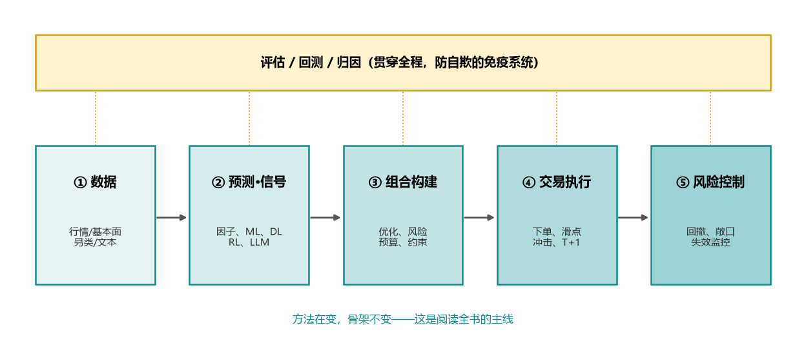
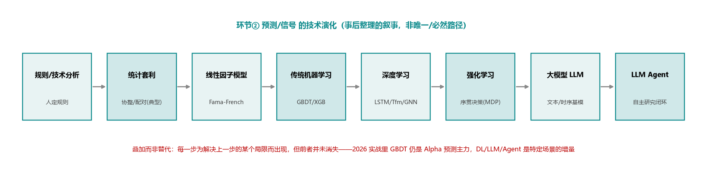

# 00 导读：量化投资技术的全局地图

> 本章不讲具体方法，只做两件事：**画一张地图**（量化系统由哪些环节构成、技术脉络如何演化），和**给一套读法**（怎么用这份综述 + 配套教学指南）。后续每一章都会回到这张地图上的某个位置。

## 0.1 这份综述回答什么、不回答什么

**和英文教材/网络综述相比，这份刻意做三件不一样的事**（也是它的存在理由）：① 不停在英文教材的一般结论，逐项落到 **A 股制度与实务的坑**；② 不只罗列方法，讲清**为什么这样演化、每种方法的失败模式与适用边界**；③ 与一本**可运行的教学指南**（`../guide/`）双轨对照，"为什么"与"怎么做"互链。

**回答**：
- 量化投资从"规则/统计套利"到"机器学习/深度学习"，再到"大模型/Agent"的**技术脉络**——不仅是"有哪些方法"，更是"**为什么会从上一步演化到下一步、每种方法的适用边界与失败模式**"。
- 每类方法的**核心原理与必要公式**、**代表性工作**、以及在 **A 股/实务**中落地的关键坑。
- 一套可对照动手的**教学指南**（见 `../guide/`），把综述里的"为什么"变成可运行的"怎么做"。

**不回答**（刻意不展开）：
- 不给"稳赚策略"或具体可直接照抄的盈利参数——市场是对抗性的，公开即衰减。
- 不做完整的数学证明体系（只给理解所需的公式）；严谨推导留给教材（见 references）。
- 不是投顾建议，不构成任何交易推荐。
- **不假装看见全部**：综述按定义只能整理"被记录、被留下来"的范式，看不见同样多、同样精巧却悄无声息失败的尝试——读者须自行为这种**幸存者偏差（survivorship bias）**打折。一部技术史里，活下来被写进书的，从来只是少数。

定位：以"自学笔记"的深度与诚实度写给**和我背景相近的自学者**（有 ML/Python 基础、金融背景不一）；引用不限论文，也含书籍、框架文档、开源仓库与权威网络资料（见 `references.md`）。

## 0.2 一张地图：量化系统的五个环节

无论用线性回归还是用 LLM Agent，一套量化系统都可以拆成同一条流水线。**方法在变，骨架不变**——这是阅读全书的主线。

| 环节 | 一句话定位 | 综述章 | 指南章 |
|---|---|---|---|
| ① 数据与特征 | 信号的天花板由数据决定；偏差在此埋下 | 02 | ch00–ch01 |
| ② 预测/信号 | 全书技术演化的主战场（因子 → ML→DL→RL→LLM→Agent） | 04（因子）、05–10 | ch03、ch05–ch12 |
| ③ 组合构建 | 把"预测"变成"持仓"：收益、风险与约束的权衡 | 03、12 | ch02、ch13 |
| ④ 交易执行 | 纸面收益与真实收益之间的鸿沟 | 08、11 | ch04、ch14 |
| ⑤ 风险控制 | 活下来比跑得快更重要 | 12 | ch13 |
| 🔁 评估/回测/归因 | 防自欺的免疫系统；过拟合是头号敌人 | 11（业绩归因见 12.3） | ch04、ch14 |

> 表里安放不进流水线某一环的三章：**01**（这张图的历史由来）、**13**（支撑它的生态与平台）、**14**（它的前瞻与展望）——它们贯穿全程或在图之外，不属于某一环。

**关键认知**：大多数人把注意力全押在环节②（"用什么模型预测"），但实战中①数据质量、③④的成本约束、🔁的过拟合治理，往往才是收益能否落地的决定因素。这份综述会反复强调这一点。

!!! quote "提醒：地图不是疆域"
    这张五环节流水线是为了"可教学"而做的**简化**——真实市场里五个环节彼此渗透、边界模糊，收益与风险是**整体涌现**的（单独最优的信号、组合、执行拼起来未必最优，拥挤与反馈恰恰诞生于环节之间）。把系统拆成五块是还原论的取舍：便于分工与学习，但**整体 ≠ 部分之和**。请把本书的任何框架都当工具，而非真理。

## 0.3 技术脉络一图流：从规则到 Agent

环节②的"预测/信号"是技术演化最剧烈的地方。脉络可以浓缩成一条线（每一步都是为了解决上一步的某个局限）：

- **规则 → 统计套利**：从"人凭经验定规则"到"用统计关系找可重复的微弱优势"。协整/配对是最经典的一支，但统计套利不止于均值回复（还含截面统计套利、因子残差套利等）。
- **统计套利 → 因子模型**：把收益解释为对若干**系统性因子**（价值、动量、规模…）的暴露，可解释、可组合（综述 04；其 CAPM/APT 根基见 03）。
- **因子 → 传统 ML**：因子是线性、人工设计的；GBDT/XGBoost 能捕捉**非线性与交互**，但仍依赖人工特征（综述 05）。
- **传统 ML → 深度学习**：让模型自己学**时序/截面/图**结构的表征（LSTM、Transformer、GNN），在序列/图/文本结构上减少手工特征依赖（综述 06）。
- **预测 → 强化学习**：不止"预测涨跌"，而是把**交易/组合/执行**建模为序贯决策(MDP)，优化**风险调整后**的长期目标（含成本与约束）。它在**执行层（拆单/最优成交）最成熟**，端到端"预测→交易"则仍以研究为主（综述 08）。
- **深度学习 → 大模型**：用 LLM 理解**非结构化文本**（新闻、研报、财报）；并出现**时序基础模型**做 zero-shot 预测——但其在金融收益预测上**实证表现有限、多属研究探索**，常打不过简单基线（综述 09）。
- **大模型 → Agent**：LLM 不只当"模型"，而当**会用工具、有记忆、能规划与反思的研究/交易主体**，尝试自动化"提假设→取数→回测→迭代"的闭环（综述 10）。

> ⚠️ 脉络是"叠加"不是"替代"：2026 年的实战系统里，**GBDT 仍是 Alpha 预测的主力**（指截面因子预测这一主战场），深度学习/LLM/Agent 是在特定场景（关系建模、文本另类数据、研究提效）上的增量，而非全面取代。综述会对每一步给"何时真的更强"的诚实评价。

!!! quote "思辨：这条线是事后整理的叙事，不是历史的必然"
    把技术史画成一条单向上升的链，是一种**辉格史观（whig history）**——容易让人误以为"沿这条路走 = 走向成功"。真实情况是：每个节点旁边都有大量**已死或仍在用的分支**，演化很大程度由算力/数据/资金驱动，而非纯粹方法优越；"后来者"不等于"更优者"。把它当作理解脉络的脚手架，别当作进步的保证。

## 0.4 全书章节总览与阅读路径

**全书 15 章一览**（难度：入门 / 进阶 / 前沿；篇幅：轻 / 中 / 重）：

| 章 | 一句话 | 难度 | 篇幅 |
|---|---|---|---|
| 00 导读 | 全局地图与读法（本章） | 入门 | 轻 |
| 01 全景与简史 | 量化简史 + **1.5 A股制度特异性**（核心差异化） | 入门 | 重 |
| 02 数据与特征工程 | A股数据生态、三大偏差、市场微观结构 | 入门偏中 | 重 |
| 03 经典金融工程基石 | EMH/CAPM/APT、组合优化、规则型择时 | 进阶（线代/凸优化） | 中 |
| 04 因子投资与 Alpha 挖掘 | 因子动物园、IC/分层检验、因子合成 | 进阶 | 重 |
| 05 传统机器学习 | 选股=监督学习、时序 CV、因果推断 | 进阶 | 重 |
| 06 深度学习 | MLP/CNN/RNN/Transformer/GNN、可解释性 | 进阶 | 中 |
| 07 时间序列与概率 | 平稳/协整、GARCH、状态空间、信号分解 | 进阶 | 中 |
| 08 强化学习 | MDP、价值/策略梯度、最优执行 | 前沿·难 | 重 |
| 09 大模型与时序基模 | 金融 LLM、情绪因子、zero-shot 时序 | 前沿 | 重 |
| 10 LLM Agent | 单/多 Agent、自动化研究闭环 | 前沿 | 重 |
| 11 回测、评估与过拟合治理 | 引擎、PBO/DSR、稳健评估 | 进阶·**关键** | 重 |
| 12 风险管理与组合构建 | VaR/CVaR、风险预算、业绩归因、监控 | 进阶 | 中 |
| 13 行业生态与平台 | 开源框架、A股平台、四框架剖析 | 入门·导览 | 中 |
| 14 挑战、局限与前沿展望 | 根本难点 + **前瞻趋势研判** | 前沿·思辨 | 重 |

> **前置知识**：假定你会 **Python、监督学习基础、基础概率统计**；**不假定金融背景**——所需金融概念随章给出，系统补课见配套指南的"金融地基"章。标"前沿/难"的章（08–10）建议放到地基之后再啃。

**按背景选起点**（针对"金融背景不一"的读者）：

- **金融/研究出身、ML 较弱** → 地基快速过，把力气花在 **05→06→08**（ML→DL→RL）补技术。
- **工程/ML 出身、金融较弱** → 重读 **01.5（A股制度）、02、03、04**，先建立金融语感再上方法章。

**按目标选路径**：

- **建立全局认知（推荐先走一遍）**：`00 → 01 → 02 → 03 → 04` 读完"地基"（数据、经典金融工程/组合、因子），再按兴趣跳读 **05–10** 的方法章，最后读 **11–14** 的评估/风控/生态/展望。
- **只关心 AI 前沿**：`00 → 05（ML）→ 06（DL）→ 08（RL）→ 09（LLM）→ 10（Agent）`，但**务必回看 11（过拟合治理）**，否则前沿方法会把你带进"回测幻觉"。
- **只做 A 股实盘**：`01.5（制度）→ 02（数据/偏差）→ 04（因子）→ 11（回测/过拟合）→ 13（平台/接口）`，把"能不能落地"放在第一位。
- **边读边动手**：每章末尾的"对应指南章"链到 `../guide/` 的可运行实现。综述讲"为什么"，指南讲"怎么做"，两者章节一一呼应，可对照阅读。

## 0.5 贯穿全书的三条警戒线

读这本书请先立一条**认识论立场**：对任何方法、任何回测、任何"更先进"的叙述，默认它**不成立**，由证据来推翻这一假设——做**检方**（想方设法证伪），而非辩方（只找有利证据）。下面三条警戒线，是这一立场的三个落点，会在几乎每一章出现：

1. **低信噪比 → 不只是难赚，更是"难归因"**：金融收益的可预测部分极小（横截面 IC 长期均值能稳定到 0.03–0.05 已属不错——这是好年份、好截面下的量级，并非可复现目标，多数时候更低甚至为负）。模型容量越大越容易"把噪声当信号"。更深的困境是：在这么弱的信号里，**单条净值曲线几乎无法区分"技艺"与"运气"**——你不仅难赚钱，更**难判断自己是否真的会赚钱**。
2. **非平稳、对抗性与反身性**：规律会漂移、会因被人发现而失效（**拥挤交易**；策略能否复制还取决于它**剩多少容量**）。更要紧的是**反身性（Soros）**——金融规律一旦被足够多人使用，就会改变它所描述的对象本身，**本书写出的每个范式，都在因被写出而衰减**；读者要把"我现在读到的，正是正在失效的"当默认前提。而最致命的一类危险是**奈特不确定性（Knight）**：模型只能管理可量化的"风险"（有分布、能估参数），但制度突变、流动性枯竭这类**没有历史分布、回测里根本不存在**的"不确定性"，才是真正让人爆仓的东西（[R76]）。
3. **过拟合是头号敌人**：在同一份历史上反复试错，必然挑出"运气最好"的策略。需要 Purged/CPCV 交叉验证、Deflated Sharpe、回测过拟合概率(PBO)等专门武器（综述 11；López de Prado 的核心告诫，[R13]）。

记住一句话（也是上面那条检方立场的浓缩）：**"一个漂亮的回测曲线，默认假设它是过拟合的，直到被严格证伪。"**

## 0.6 符号与术语约定

| 符号 | 含义 |
|---|---|
| $r_{t}$ | 简单收益率 $r_t = P_t/P_{t-1}-1$ |
| $\tilde r_t = \ln(P_t/P_{t-1})$ | 对数收益率（$=\ln(1+r_t)$；可加性，便于跨期求和） |
| $\mathbf{w}$ | 组合权重向量 |
| $\boldsymbol{\mu},\ \boldsymbol{\Sigma}$ | 期望收益向量、收益协方差矩阵 |
| IC / RankIC | **横截面**预测值与未来收益的（秩）相关系数（同一时点对一篮子股票算，按期计算再取时序均值），信号质量核心指标 |
| IR | 信息比率 = 主动收益均值 / 跟踪误差（= 主动收益的标准差）；通常**年化** |
| Sharpe | 夏普比率 = （收益−无风险）/ 波动率；通常**年化**。基准取无风险利率时 IR 退化为 Sharpe |
| Alpha / Beta | Alpha = **风险（因子）调整后**的主动收益（因子回归的截距 $\alpha$）；Beta = 对系统性因子的暴露（回归载荷） |
| 因子中性化 | 把信号对行业/市值等已知暴露做**横截面回归取残差**，得到"纯净"信号 |
| T+1 / 涨跌停 | 当日买入次日才可卖；涨跌停：主板 **±10%**、创业板/科创板 **±20%**、北交所 **±30%**、ST **±5%**（详见 01.5 / 指南金融地基） |

> 术语首次出现时给中英文对照；英文库名/模型名保留原文（如 Qlib、LightGBM、Transformer）。

## 0.7 小结与下一步

- 量化系统 = **数据 → 信号 → 组合 → 执行 → 风控**，外加贯穿的**评估/回测/归因**；方法在变，骨架不变。
- 技术脉络是一条"为解决上一步局限而演化"的线：规则 → 统计套利 → 因子 → ML → DL → RL → LLM → Agent，且**叠加而非替代**。
- 三条警戒线——低信噪比、非平稳、过拟合——决定了量化与普通 ML 的根本区别。

!!! question "读者自检（答得上来，就可以按 0.4 选条路径出发）"
    1. 一套量化系统由哪**五个环节**构成？哪个环节最常被高估、哪些最被低估？
    2. 技术脉络为什么是"**叠加而非替代**"？举一个"新方法不一定胜旧方法"的例子。
    3. 为什么说"漂亮的回测**默认是过拟合的**"？在 IC 0.03–0.05 的世界里，你凭什么相信赚到的是能力而不是运气？

**下一章（01 全景与简史）**：把这张地图放回历史，看每个阶段是被什么问题与什么人推动出现的，并系统对比 A 股与美股市场在数据、制度、参与者结构上的差异——这些差异直接决定了后面每种方法在 A 股能否奏效。

---
*引用见 `references.md`（[R13] López de Prado 2018；[R15] Gu-Kelly-Xiu 2020）。配套实现见 `../guide/`。*
